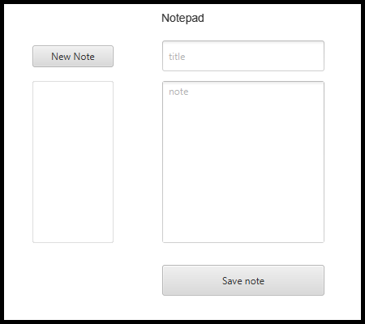

# Notisblokk
This application was made as the first part of a group project. 
We decided to create a diary-type application, in which the user can scribble category,
save them, and open them at a later time.

GUI in Deliverable 1          |  GUI in Deliverable 2: Updated to include a delete button
:-------------------------:|:-------------------------:
  |  


# Overview 
The file structure of this project is module based, where different types of logic are put into
separate Gradle sub-projects.

- ***core***/src/main/java - Handles the all the pure logic of the application
- ***fxui***/src/main/java - All GUI parts
- ***restapi***/src/main/java - Spring boot server running a REST API

### User Story
We are actively using Issues and Milestones in GitLab to track our progress and tasks that
need to be completed. This is also where we keep most of our user stories.

Week 1: The goal for this week was having a Minimum Viable Product (MVP) ready. One example of an
user story we worked on is `I want to be able to save the note I wrote to continue later`.

Week 4: In deliverable 2, we decided to work on one more user story: `I want to be able to delete category if I don't need them anymore`.

### Deliverable 2 workflow

For delivery 2, we decided to divide ourselves into two groups. Thomas and Karl Petter worked on the Rest API part, while Julie and Benedicte worked on the GUI. We worked mostly by pair programming. In the final week before delivery, we switched up the groups, so all groupmembers could learn both how the backend and the frontend in our app works. 

# Quickstart: Build and run

The project is built and run with Gradle following these steps:

1. Clone the project
```bash
$ git clone https://gitlab.stud.idi.ntnu.no/it1901/gr1915/gr1915.git
```
2. Import the directory `/notisblokk` as a Gradle Project in your IDE
3. Build the project
```bash
$ ./gradlew clean build
```
4. Start the backend Spring Boot server
```bash
$ ./gradew bootRun
```
5. Start the frontend FX application (*depends on Spring Boot*)
```bash
$ ./gradlew run
```
